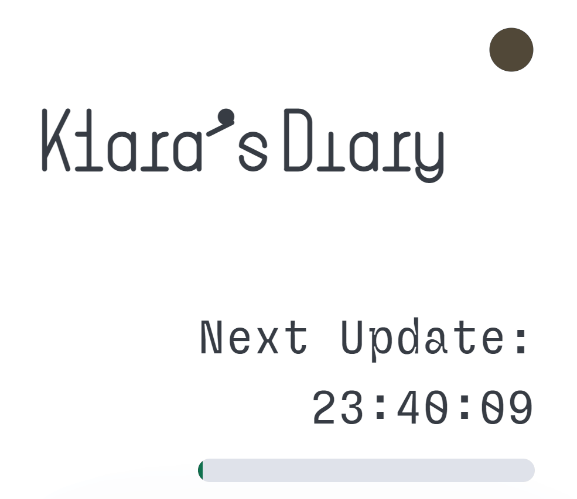

# Klara's Diary

    

[Experience it now at itch.io](https://intelagense.itch.io/klaras-diary)

Klara's Diary is a "web-based sci-fi psychological horror interactive short story mystery game... or something." which was built for the [#10DayWebBuild](https://10daywebbuild.netlify.app/) social media challenge. Players must log in every 24 hours to descramble new messages received from a mysterious space station.

## Tech used:

[Pico ✨](https://v2.picocss.com/docs)

[theme-toggles](https://toggles.dev/)

[SeededShuffle](https://github.com/LouisT/SeededShuffle)

[Velvetyne Fonts](https://velvetyne.fr/)

### Process

Built over the course of ten days using mostly vanilla JavaScript with a helper library for encryption. The site uses localStorage to track the elapsed time and a handful of obfuscation techniques to look like it is doing more than it really is. Pico ✨ was chosen for its minimal look and ease of use. 

## Optimizations
---

### Todo
- Fix animation for the dark/light theme toggle icon 
- Test accessibility features  
- Implement a better way to mark and highlight keywords (current method involves a lot of hard coding and testing. One approach would be to store the game data as markdown files instead of plain strings)
- Addition of a help and instruction modal with a gameplay reset button  

## Lessons Learned
---

The original scope included building out a custom encryption algorithm that incorporated psuedo lossy encyption of the game content so that the original source material could never be truely verified but this idea was abandoned after about 10 minutes. 

## Usage
---

The full source code for the logic is included in the repository. The original game content and story are loosely encrypted and stored directly in a JavaScript object in a separate source file. "Steal" my code all you want but dont steal my story, because I spent like 4 days writing all that. 

Fonts used:

[Mono by Frank Adebiaye](http://velvetyne.fr/fonts/mono/)

[Sligoil by Ariel Martín Pérez](http://velvetyne.fr/fonts/sligoil/)
